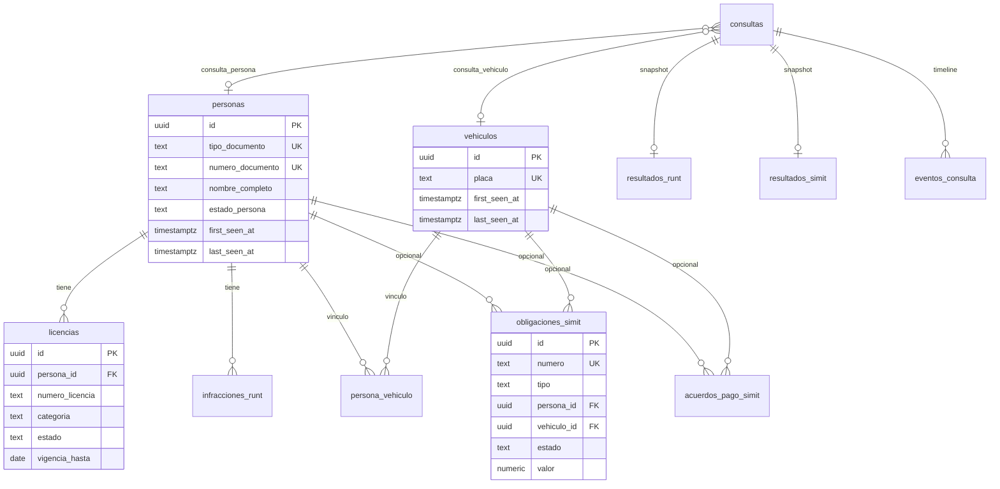

# Diseño de base de datos v2 — Turn Dispenser

Plan de datos para evolucionar de “solo corridas” a **maestros + hechos tipados + historial de consultas**, alineado al PRD (RF-13…RF-16) y a los hallazgos del smoke manual post–E-03.

**Estado:** diseño objetivo; **migración F-01 aplicada** en `supabase/migrations/20260803220000_maestros_y_hechos_tipados_v2.sql`. Contrato desplegable: [`db-schema.md`](db-schema.md).  
**Stack:** PostgreSQL del Supabase local (Docker).  
**Principio:** hechos oficiales observados; **cero** elegibilidad / “puede tramitar”.

---

## 1. Hallazgos del smoke que condicionan el diseño

| Hallazgo | Implicación en BD / app |
|----------|-------------------------|
| Misma placa/documento → múltiples filas en `consultas` | Correcto: `consultas` es **append-only**. Los maestros se **upsert**ean. |
| `tipo_documento` NULL en modo placa | Correcto. El discriminador es `consultas.modo` ∈ {`DOCUMENTO`,`PLACA`}. No inventar `es_placa`. |
| SIMIT “sin pendientes” es un estado válido (hoy lento en scraper) | Persistir `sin_pendientes` / cero filas de obligaciones; no exigir filas en tablas de hechos. |
| BD caída: UI sigue, `persistido=False` | Persistencia no bloquea la respuesta al operador. |
| Quieren registrar **personas/vehículos**, no solo corridas | Capa de **entidades** + vínculo a cada `consulta`. |
| Nueva consulta sin reiniciar la app | Requisito UX (no borra BD); limpia estado de sesión. |
| HTML de portales inestable | Columnas tipadas + `atributos jsonb` + `raw_html` en snapshot de corrida. |

---

## 2. Arquitectura lógica (3 capas)

```text
┌─────────────────────────────────────────────────────────────┐
│  A. OPERATIVA / AUDITORÍA (por corrida)                     │
│     consultas → resultados_runt / resultados_simit          │
│               → eventos_consulta                            │
│     Append-only. Evidencia raw_html. Correlation id.        │
├─────────────────────────────────────────────────────────────┤
│  B. MAESTROS (identidad durable)                            │
│     personas  ·  vehiculos  ·  persona_vehiculo             │
│     Upsert por clave natural. first_seen / last_seen.       │
├─────────────────────────────────────────────────────────────┤
│  C. HECHOS TIPADOS (lo que reportan las fuentes)            │
│     licencias · infracciones_runt · obligaciones_simit      │
│     acuerdos_pago_simit                                     │
│     Upsert por clave de negocio + last_consulta_id.         │
└─────────────────────────────────────────────────────────────┘
```

**Por qué no solo maestros:** el componente futuro de decisión (RF-15) necesita saber *qué se vio en qué momento* y poder re-parsear (`raw_html`).  
**Por qué no solo corridas:** el operador/CRC necesita historial de persona/vehículo consultable sin re-scrapear.

---

## 3. Modelo entidad-relación (objetivo)



---

## 4. Catálogo de tablas

### 4.1 Capa A — Operativa (evolución de lo actual)

#### `consultas` (se mantiene, se enriquece)

Cabecera **append-only** de cada ejecución.

| Columna | Notas |
|---------|--------|
| `id` uuid PK | |
| `correlation_id` | Logs / UI |
| `modo` | `DOCUMENTO` \| `PLACA` — **única** forma de saber el tipo de entrada |
| `identificador` | Documento o placa tal como se consultó (normalizado) |
| `tipo_documento` | NOT NULL solo si `modo=DOCUMENTO` |
| `persona_id` | FK nullable → maestro resuelto post-parse |
| `vehiculo_id` | FK nullable → maestro resuelto (modo placa o placa hallada en hechos) |
| `estado` | `en_progreso` \| `ok` \| `parcial` \| `error` \| `omitido` |
| `operador`, `estacion`, `app_version` | Metadatos estación |
| `iniciado_en`, `finalizado_en`, `duracion_ms` | |
| `error_runt`, `error_simit` | |
| `schema_version` | Contrato cabecera (`2` al adoptar v2) |
| `created_at`, `updated_at` | |

Índices: `(modo, identificador)`, `persona_id`, `vehiculo_id`, `created_at DESC`, `correlation_id`.

#### `resultados_runt` / `resultados_simit` (se mantienen)

Snapshots **1:1** por consulta (`UNIQUE consulta_id`, upsert).  
Aquí vive `raw_html`, `secciones` / JSONB de listas, flags `sin_registro`, y en SIMIT el resumen con `sin_pendientes`.

> Los maestros y hechos tipados se **derivan** de estos snapshots; no se elimina el snapshot.

#### `eventos_consulta` (se mantiene)

Timeline de automatización (RF-19).

---

### 4.2 Capa B — Maestros

#### `personas`

| Columna | Notas |
|---------|--------|
| `id` uuid PK | |
| `tipo_documento` | CC, CE, TI, … |
| `numero_documento` | Solo dígitos/normalizado |
| `nombre_completo` | Último valor visto (RUNT) |
| `estado_persona` | Hecho RUNT si existe |
| `numero_inscripcion_runt` | Si existe |
| `fecha_inscripcion_runt` | Texto o date si parseable |
| `atributos` jsonb | Extensión defensiva |
| `first_seen_at`, `last_seen_at` | |
| `last_consulta_id` | FK a `consultas` |
| `created_at`, `updated_at` | |

**UK:** `(tipo_documento, numero_documento)`.

#### `vehiculos`

| Columna | Notas |
|---------|--------|
| `id` uuid PK | |
| `placa` | Uppercase, sin espacios/guiones |
| `atributos` jsonb | Marca, clase, etc. si alguna fuente los expone |
| `first_seen_at`, `last_seen_at` | |
| `last_consulta_id` | |
| `created_at`, `updated_at` | |

**UK:** `(placa)`.

#### `persona_vehiculo`

Relación N:M cuando una fuente asocie persona↔placa (comparendo con ambos, o secciones RUNT).

| Columna | Notas |
|---------|--------|
| `persona_id`, `vehiculo_id` | PK compuesta o uuid + UK |
| `fuente` | `RUNT` \| `SIMIT` \| `SISTEMA` |
| `first_seen_at`, `last_seen_at` | |
| `last_consulta_id` | |

No inventar vínculo si la fuente no lo muestra.

---

### 4.3 Capa C — Hechos tipados

#### `licencias` (origen típico: RUNT)

Asociadas a **persona**.

| Columna | Notas |
|---------|--------|
| `id` uuid PK | |
| `persona_id` FK | NOT NULL |
| `numero_licencia` | Si el portal lo trae |
| `categoria` | |
| `estado` | |
| `fecha_expedicion` / `fecha_vencimiento` | Nullable / texto si inestable |
| `atributos` jsonb | Resto de columnas del panel |
| `fuente` | default `RUNT` |
| `last_consulta_id` | |
| `first_seen_at`, `last_seen_at` | |

**UK sugerida:** `(persona_id, coalesce(numero_licencia, md5(atributos::text)))` — o UK parcial cuando `numero_licencia` NOT NULL.

#### `infracciones_runt` (panel RUNT “MULTAS E INFRACCIONES”)

Asociadas a **persona** (el ciudadano consultado).  
Nombre deliberado: no mezclar con obligaciones SIMIT.

| Columna | Notas |
|---------|--------|
| `id` uuid PK | |
| `persona_id` FK | |
| `placa` / `vehiculo_id` | Si el hecho lo trae |
| `descripcion`, `estado`, `fecha`, `valor` | Tipados opcionales |
| `atributos` jsonb | Fila cruda del parser |
| `fingerprint` | Hash estable de campos clave para upsert |
| `last_consulta_id` | |

**UK:** `(persona_id, fingerprint)`.

#### `obligaciones_simit` (comparendos **y** multas SIMIT)

SIMIT mezcla “comparendos/multas” en una lista (`ComparendoMulta`). **No** forzar tablas separadas hasta que el parser distinga tipos de forma fiable.

| Columna | Notas |
|---------|--------|
| `id` uuid PK | |
| `numero` | Clave de negocio cuando existe |
| `tipo` | Valor del portal (`comparendo`, `multa`, texto libre) |
| `persona_id` | Nullable — si la consulta fue por documento o el resumen trae cédula |
| `vehiculo_id` | Nullable — si hay placa en el hecho o modo PLACA |
| `fecha_imposicion`, `notificacion`, `secretaria` | |
| `infraccion`, `infraccion_descripcion` | |
| `estado`, `valor`, `valor_a_pagar` | Preferir numeric cuando parseable; si no, text + jsonb |
| `atributos` jsonb | |
| `fuente` | `SIMIT` |
| `last_consulta_id` | |
| `first_seen_at`, `last_seen_at` | |
| `activo_en_ultima_consulta` | bool — útil si un número deja de aparecer |

**UK:** `(numero)` donde `numero` NOT NULL; si falta número → `(fingerprint)`.

> Corrección al modelo sugerido en smoke: **no** “comparendos solo en vehículos” y “multas solo en personas”. En SIMIT ambos van en la misma estructura y pueden tener placa **y** documento.

#### `acuerdos_pago_simit`

Misma lógica de FKs opcionales `persona_id` / `vehiculo_id`, UK por `numero_acuerdo` o fingerprint.

---

### 4.4 Tablas que **no** se crean (a propósito)

| Idea | Motivo |
|------|--------|
| `apto` / `elegible` / `puede_tramitar` | Fuera de alcance (PRD) |
| `es_placa` boolean | Redundante con `consultas.modo` |
| Separar `comparendos` vs `multas` SIMIT ya | Parser aún no garantiza discriminación estable |
| Borrar `resultados_*` al normalizar | Se pierde evidencia RF-12 / re-parseo |

---

## 5. Flujos de escritura (post-consulta)

```text
1. INSERT consultas (estado final ok|parcial|error)
2. UPSERT resultados_runt / resultados_simit (ON CONFLICT consulta_id)
3. INSERT eventos_consulta (si aplica)
4. Resolver maestros:
   a. modo DOCUMENTO → UPSERT personas (tipo+numero)
      + si SIMIT/RUNT trae placas → UPSERT vehiculos + persona_vehiculo
   b. modo PLACA → UPSERT vehiculos(placa)
      + si resumen SIMIT trae cédula → UPSERT personas + vínculo
5. UPSERT hechos tipados (licencias, infracciones_runt, obligaciones_simit, acuerdos)
6. UPDATE consultas SET persona_id, vehiculo_id
```

**Transacción:** preferible una sola transacción por corrida.  
**Fallo en capa B/C:** no debe impedir que capa A quede guardada (política: snapshot primero; normalización best-effort logueada). Alternativa estricta: todo-o-nada — decidir en ticket de implementación; recomendación piloto = **snapshot obligatorio, normalización best-effort**.

**Sin pendientes SIMIT:** `resultados_simit` con resumen `sin_pendientes=true` y **cero** filas nuevas de obligaciones (o marcar `activo_en_ultima_consulta=false` en las previas de ese maestro si se adopta sincronización por consulta).

---

## 6. Normalización y claves

| Entidad | Normalización |
|---------|----------------|
| Documento | trim; solo caracteres válidos del validador actual |
| Placa | `upper(trim)`; quitar espacios y guiones |
| Montos | intentar numeric COL; si falla, guardar text en columna text/`atributos` |
| Fechas | intentar `date`/`timestamptz`; si falla, text en `atributos` |

---

## 7. Retención y PII

| Dato | Política piloto |
|------|-----------------|
| Maestros + hechos tipados | Retener (base del CRC); sin cloud aún |
| `raw_html` en `resultados_*` | ≤ 30 días; nullify con `scripts/purge_raw_html.py` (F-07) |
| Logs archivo | Según `LOG_FILE` / rotación estación |
| Delete persona | Cascade hechos tipados; consultas pueden anonimizar FKs (`ON DELETE SET NULL`) |

RLS: igual que v1 en local (authenticated/service_role); cloud = ticket aparte.

---

## 8. Versionado (RF-16)

| Artefacto | Versión |
|-----------|---------|
| `consultas.schema_version` | `2` al introducir FKs a maestros |
| `SCHEMA_VERSION_RUNT` / `SIMIT` | Subir cuando cambie forma de secciones/listas |
| Migraciones | Solo en `supabase/migrations/YYYYMMDDHHMMSS_*.sql` |
| Parsers | Campos opcionales; poblar `atributos` antes que romper UK |

---

## 9. UX relacionada (fuera de SQL, obligatoria en reglas)

- **Nueva consulta / Limpiar:** resetea formulario, labels, panel de resultados y habilitación de Reintentar; **no** borra filas en BD.
- Cada “Consultar” genera nuevo `consultas.id` aunque sea el mismo ciudadano.

---

## 10. Scraper / SIMIT (hallazgo técnico)

`wait_for_results` no debe esperar en serie 30s×N selectores.  
El estado “No tienes comparendos ni multas…” es éxito (`sin_pendientes`), no timeout.

---

## 11. Plan de migración (fases)

Tickets detallados: [`tickets/F-00-indice-plan-implementacion-v2.md`](tickets/F-00-indice-plan-implementacion-v2.md).

| Fase | Ticket | Entrega | Riesgo |
|------|--------|---------|--------|
| **M0** | — | Diseño + reglas Cursor (hecho) | Bajo |
| **M1** | F-01 | Migración maestros + hechos; FKs nullable en `consultas` | Medio |
| **M2** | F-02 | Repositorio: upsert maestros/hechos post-snapshot | Medio |
| **M3** | F-06 | Backfill opcional desde `resultados_*` | Bajo |
| **M4** | F-03 + F-05 | UI “Nueva consulta” + verificación e2e upsert | Bajo |
| **M5** | F-04 | Fix espera SIMIT sin pendientes | Bajo |
| **M6** | F-07 | Retención `raw_html` | Bajo |

v1 (`consultas` + `resultados_*` + `eventos`) **no se elimina** en M1.

---

## 12. Criterios de aceptación del modelo v2

1. Consultar 2 veces la misma CC → 2 `consultas`, **1** `personas`.
2. Consultar 2 veces la misma placa → 2 `consultas`, **1** `vehiculos`.
3. DOCUMENTO con obligaciones SIMIT → filas en `obligaciones_simit` con `persona_id` y `vehiculo_id` si hay placa.
4. PLACA sin pendientes → `vehiculos` upsert + `resultados_simit.sin_pendientes` / resumen; 0 obligaciones nuevas.
5. Modo PLACA: `tipo_documento` NULL; `modo='PLACA'`.
6. Ninguna columna de elegibilidad.
7. Snapshot `raw_html` sigue guardándose cuando la fuente OK.
8. Fallo de normalización no oculta el resultado en UI.

---

## 13. Relación con documentos actuales

| Doc | Rol tras v2 |
|------|-------------|
| [`db-schema.md`](db-schema.md) | Contrato **desplegable** (v2 tras F-01; capa A intacta) |
| Este archivo | Contrato **objetivo** / justificación del modelo |
| [`persistencia.md`](persistencia.md) | Actualizar en M2 |
| [`supabase-local.md`](supabase-local.md) | Sin cambio de stack |
