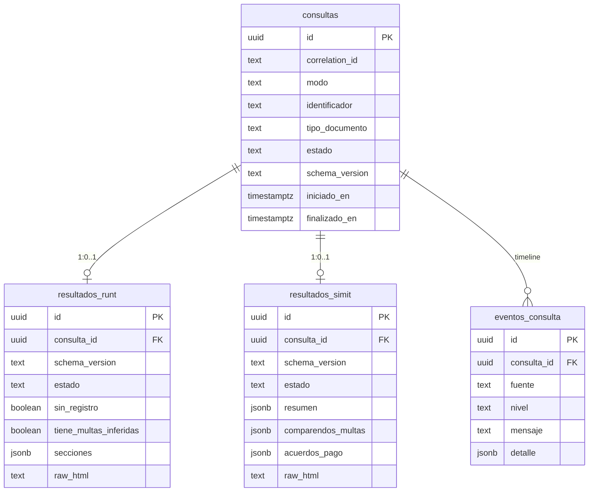

# Esquema de base de datos (D-01)

Persistencia de **hechos oficiales** reportados por RUNT y SIMIT.  
No hay tablas ni columnas de elegibilidad / “puede tramitar”.

**Stack:** PostgreSQL del stack **Supabase local (Docker)**.  
**Migraciones:** `supabase/migrations/` (única convención del proyecto).  
**Arranque del entorno:** [`supabase-local.md`](supabase-local.md).

Versión de contrato de persistencia de cabecera: `consultas.schema_version = '1'`.  
Versiones de payload por fuente: `resultados_*.schema_version` (= `SCHEMA_VERSION_RUNT` / `SCHEMA_VERSION_SIMIT` en `models/`).

---

## Diagrama

---

## Tablas

### `consultas`

Cabecera de cada corrida. Mapea `ConsultaParams` + metadatos de `ResultadoConsulta`.

| Columna | Modelo / uso |
|---------|----------------|
| `correlation_id` | `ResultadoConsulta.correlation_id` |
| `modo` | `DOCUMENTO` \| `PLACA` |
| `identificador` | número de documento o placa |
| `tipo_documento` | obligatorio si `modo = DOCUMENTO` |
| `estado` | `en_progreso` \| `ok` \| `parcial` \| `error` \| `omitido` |
| `operador` / `estacion` | metadatos operativos (opcional; aún no en dataclass) |
| `iniciado_en` / `finalizado_en` | timestamps de la corrida |
| `error_runt` / `error_simit` | errores de orquestación por fuente |
| `schema_version` | contrato de la fila cabecera (RF-16) |

**Índices:** `identificador`, `correlation_id`, `created_at desc`, `(modo, estado)`.

### `resultados_runt`

1:1 con `consultas`. Mapea `ResultadoRunt`. En modo `PLACA` la fila puede omitirse o guardarse con `estado = 'omitido'`.

Columnas tipadas: `nombre`, `estado_licencia`, `tipo_documento`, `numero_documento`, `estado_persona`, `numero_inscripcion`, `fecha_inscripcion`.  
Payload flexible: `secciones` (JSONB).  
Heurística: `tiene_multas_inferidas` (no es regla de negocio).  
Evidencia: `raw_html`.

### `resultados_simit`

1:1 con `consultas`. Mapea `ResultadoSimit`.

| Columna JSONB | Modelo |
|---------------|--------|
| `resumen` | `ResumenSimit` |
| `comparendos_multas` | `list[ComparendoMulta]` |
| `acuerdos_pago` | `list[AcuerdoPago]` |
| `total_comparendos_multas` / `total_acuerdos_pago` | `TotalSeccion` |
| `datos_raw` | `ResultadoSimit.datos_raw` |

### `eventos_consulta`

Timeline de la corrida (soporte / auditoría). No sustituye logs de archivo; complementa RF de trazabilidad.

---

## Fuera de esquema (a propósito)

- Cualquier columna tipo `apto`, `puede_tramitar`, `elegible`, score de decisión.
- Motor de reglas.
- Histórico de UI / favoritos del operador (futuro).

---

## Política mínima de datos personales

| Tema | Política (piloto local) |
|------|-------------------------|
| Qué se guarda | Identificador consultado, hechos extraídos, errores, eventos, opcionalmente `raw_html`. |
| `raw_html` | Evidencia técnica (re-parseo / soporte). Contiene datos personales. **Retención recomendada ≤ 30 días** en estaciones de desarrollo/piloto. |
| Borrado | Cascade desde `consultas` borra resultados y eventos. Purge periódico de `raw_html` (null) o borrado de filas > N días — automatizar en tickets posteriores. |
| Acceso | App de escritorio vía `service_role` / Postgres (D-02). RLS activo; sin políticas `anon` de escritura. |
| Secretos | Nunca versionar `.env`, keys ni volúmenes Docker. Ver `.gitignore`. |
| Producción / Cloud | Fuera de D-01; requerirá políticas RLS por estación/rol y rotación de keys. |

---

## Versionado (RF-16)

1. Cambios de forma en `secciones` / payloads tipados → subir `SCHEMA_VERSION_*` en `models/` y persistir en `resultados_*.schema_version`.
2. Cambios estructurales de tablas → nueva migración en `supabase/migrations/YYYYMMDDHHMMSS_descripcion.sql`.
3. Parsers deben degradar con campos opcionales; no asumir HTML estable.

---

## Relación con tickets siguientes

| Ticket | Uso del esquema |
|--------|-----------------|
| **D-02** | Repositorios Python contra estas tablas / `DATABASE_URL` |
| **D-03** | Persistencia post-consulta desde `ConsultaController` |
| **D-04** | Verificación end-to-end de filas + `raw_html` |
