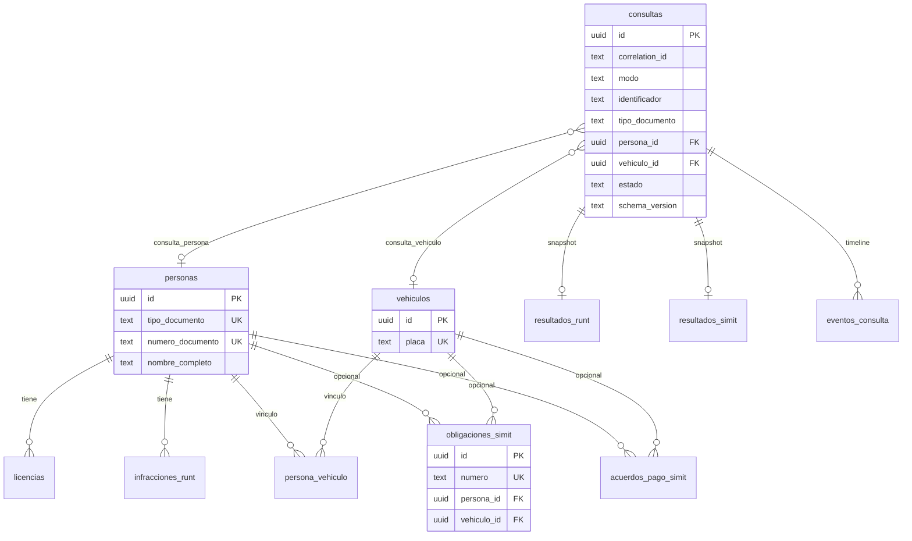

# Esquema de base de datos — contrato v2 (F-01 aplicado)

Persistencia de **hechos oficiales** reportados por RUNT y SIMIT.  
No hay tablas ni columnas de elegibilidad / “puede tramitar”.

> **Diseño completo:** [`DB_DESIGN_V2.md`](DB_DESIGN_V2.md).  
> **Migraciones:** `supabase/migrations/` — v1 operativa + v2 maestros/hechos.

**Stack:** PostgreSQL del stack **Supabase local (Docker)**.  
**Arranque del entorno:** [`supabase-local.md`](supabase-local.md).  
**Aplicar (NTFS / disco externo):** `./scripts/apply_local_migrations.sh` (o `--reset`).

Versión de contrato de cabecera: `consultas.schema_version = '2'` (`SCHEMA_VERSION_CONSULTA`).  
Versiones de payload por fuente: `resultados_*.schema_version` (= `SCHEMA_VERSION_RUNT` / `SCHEMA_VERSION_SIMIT` en `models/`; aún `1`).

---

## Capas

| Capa | Tablas | Semántica |
|------|--------|-----------|
| **A. Operativa** | `consultas`, `resultados_runt`, `resultados_simit`, `eventos_consulta` | Append-only por corrida; snapshots 1:1; timeline |
| **B. Maestros** | `personas`, `vehiculos`, `persona_vehiculo` | Upsert por clave natural |
| **C. Hechos tipados** | `licencias`, `infracciones_runt`, `obligaciones_simit`, `acuerdos_pago_simit` | Upsert por UK de negocio / fingerprint |

La app v1 sigue escribiendo capa A; normalización B/C llega en F-02.

---

## Diagrama

---

## Capa A — Operativa

### `consultas`

Cabecera **append-only** de cada corrida. Discriminador de entrada: `modo` ∈ {`DOCUMENTO`,`PLACA`} (no hay `es_placa`).

| Columna | Uso |
|---------|-----|
| `correlation_id` | Logs / UI |
| `modo` / `identificador` | Entrada normalizada |
| `tipo_documento` | NOT NULL solo si `modo=DOCUMENTO`; NULL en `PLACA` |
| `persona_id` / `vehiculo_id` | FK nullable → maestros (poblados en F-02) |
| `estado` | `en_progreso` \| `ok` \| `parcial` \| `error` \| `omitido` |
| `operador` / `estacion` / `app_version` | Metadatos estación |
| `schema_version` | Contrato cabecera (`2`) |
| `iniciado_en` / `finalizado_en` / `duracion_ms` | |
| `error_runt` / `error_simit` | |

**Índices:** `identificador`, `correlation_id`, `created_at desc`, `(modo, estado)`, `(modo, identificador)`, `persona_id`, `vehiculo_id`.

### `resultados_runt` / `resultados_simit`

Snapshots **1:1** (`UNIQUE consulta_id`, upsert). Conservan `raw_html`, JSONB de secciones/listas y flags (`sin_registro`, SIMIT `sin_pendientes` en resumen). Los maestros/hechos se **derivan** de aquí; no se eliminan.

### `eventos_consulta`

Timeline de automatización (RF-19).

---

## Capa B — Maestros

### `personas`

**UK:** `(tipo_documento, numero_documento)`.  
Campos: `nombre_completo`, `estado_persona`, `numero_inscripcion_runt`, `fecha_inscripcion_runt` (text), `atributos` jsonb, `first_seen_at` / `last_seen_at`, `last_consulta_id`.

### `vehiculos`

**UK:** `(placa)` normalizada.  
Campos: `atributos`, `first_seen_at` / `last_seen_at`, `last_consulta_id`.

### `persona_vehiculo`

PK `(persona_id, vehiculo_id)`. `fuente` ∈ {`RUNT`,`SIMIT`,`SISTEMA`}. Solo cuando una fuente asocie persona↔placa.

---

## Capa C — Hechos tipados

### `licencias`

Asociadas a persona. UK parcial: `(persona_id, numero_licencia)` si hay número; si no, `(persona_id, md5(atributos))`.

### `infracciones_runt`

Panel RUNT “MULTAS E INFRACCIONES”. **UK:** `(persona_id, fingerprint)`. `placa` / `vehiculo_id` opcionales.

### `obligaciones_simit`

Comparendos **y** multas SIMIT en una tabla. `persona_id` y `vehiculo_id` **nullable**. UK: `(numero)` si existe; si no, `(fingerprint)`.

### `acuerdos_pago_simit`

Misma lógica de FKs opcionales. UK: `(numero_acuerdo)` o `(fingerprint)`.

---

## Fuera de esquema (a propósito)

- Cualquier columna `apto`, `puede_tramitar`, `elegible`, score de decisión.
- `es_placa` (redundante con `consultas.modo`).
- Tablas separadas comparendos vs multas SIMIT (parser aún no discrimina de forma estable).
- Motor de reglas / autorización de trámite.

---

## Política mínima de datos personales

| Tema | Política (piloto local) |
|------|-------------------------|
| Qué se guarda | Identificador, hechos, maestros, errores, eventos, opcionalmente `raw_html`. |
| `raw_html` | Evidencia técnica. Contiene PII. **Retención recomendada ≤ 30 días**. |
| Borrado persona | Cascade en hechos tipados / `persona_vehiculo`; `consultas.persona_id` → `ON DELETE SET NULL`. |
| Acceso | App vía `DATABASE_URL` / service_role. RLS activo; sin escritura `anon`. |
| Secretos | Nunca versionar `.env`, keys ni volúmenes Docker. |

---

## Versionado (RF-16)

1. Cambios de forma en `secciones` / payloads tipados → subir `SCHEMA_VERSION_*` en `models/` y `resultados_*.schema_version`.
2. Cambios estructurales de tablas → nueva migración en `supabase/migrations/YYYYMMDDHHMMSS_descripcion.sql`.
3. Cabecera con FKs a maestros → `consultas.schema_version` / `SCHEMA_VERSION_CONSULTA = '2'`.
4. Parsers: campos opcionales; poblar `atributos` antes que romper UK.

---

## Relación con tickets

| Ticket | Uso |
|--------|-----|
| **F-01** | Esta migración + docs (hecho) |
| **F-02** | Upsert Python maestros/hechos post-snapshot |
| **F-06** | Backfill opcional desde JSONB de `resultados_*` |
