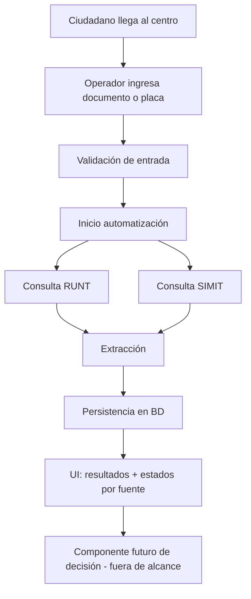

# PRD — Turn Dispenser

**Product Requirements Document**  
**Versión:** 1.0  
**Fecha:** 21 de julio de 2026  
**Rol en el repo:** documentación oficial del producto (fuente de verdad de objetivos y alcance).  
**Alcance del documento:** especificación funcional del negocio; el estado de implementación se resume en el [`README.md`](../README.md).

---

## 1. Resumen ejecutivo

**Turn Dispenser** es una aplicación de escritorio en Python que automatiza, con Playwright, consultas a plataformas oficiales de tránsito en Colombia (principalmente [RUNT](https://portalpublico.runt.gov.co/#/consulta-ciudadano-documento/consulta/consulta-ciudadano-documento) y [SIMIT](https://www.fcm.org.co/simit/#/home-public)).

Su propósito es **reducir el tiempo operativo** de los funcionarios que atienden ciudadanos en CRC y centros de trámites asociados a la Secretaría de Movilidad, al:

1. Consultar fuentes oficiales de forma automática.
2. Extraer y consolidar la información del ciudadano.
3. Persistir esa información en una base de datos.
4. Exponer el progreso y los errores de forma clara al operador.

**Decisión de elegibilidad del trámite:** fuera de alcance. Otro componente (futuro) usará los datos persistidos. Este producto responde solo a: *“¿Qué reportan las fuentes oficiales sobre este ciudadano/vehículo?”*

---

## 2. Problema

Hoy los funcionarios realizan consultas repetitivas y manuales en varias plataformas web antes de atender un trámite. Eso implica:

- Tiempo perdido por consulta y por digitación.
- Riesgo de inconsistencias al consolidar información de varias fuentes.
- Dificultad para reutilizar o auditar lo consultado.
- Dependencia de procesos manuales frágiles ante cambios en las plataformas.

---

## 3. Objetivos del producto

| ID | Objetivo | Medición sugerida |
|----|----------|-------------------|
| O1 | Automatizar consultas a RUNT y SIMIT a partir de documento o placa | % de consultas completadas sin intervención manual (salvo retos de seguridad de la plataforma) |
| O2 | Extraer de forma fiable la información disponible en esas fuentes | Completitud de campos extraídos vs. campos visibles en la UI oficial |
| O3 | Persistir toda la información obtenida | 100% de consultas exitosas o parciales con registro en BD |
| O4 | Reducir tiempo operativo previo al turno | Tiempo medio “datos ingresados → información consolidada” |
| O5 | Dar visibilidad del proceso al operador | Estados de progreso, errores y logs accionables |

### No-objetivos (explícitos)

- Decidir si el ciudadano puede continuar con un trámite.
- Implementar reglas de negocio de elegibilidad o restricciones.
- Sustituir el criterio del funcionario o de sistemas posteriores de decisión.
- Asumir trámites, tipologías o flujos de aprobación no definidos.

---

## 4. Usuarios y contexto

### 4.1 Persona principal

**Funcionario de atención / operador de CRC o centro de trámites**

- Atiende ciudadanos en ventanilla o punto de recepción.
- Necesita información oficial rápida y consolidada antes o al solicitar turno.
- No es desarrollador; requiere UI clara, progreso visible y mensajes de error comprensibles.

### 4.2 Usuario secundario (futuro / indirecto)

**Sistema o componente de decisión de negocio**

- Consumirá datos ya persistidos.
- No forma parte del alcance actual; solo define el requisito de **persistencia completa y trazable**.

### 4.3 Contexto de uso

1. Ciudadano llega a CRC / centro de trámites.
2. Antes del turno, el sistema pide datos según el trámite:
   - Tipo y número de documento, **o**
   - Número de placa.
3. La aplicación consulta RUNT y SIMIT (y, a futuro, otras fuentes oficiales si se definen).
4. Se extrae la información disponible.
5. Se persiste en base de datos.
6. Un componente posterior (fuera de alcance) decide continuidad del trámite.

---

## 5. Alcance

### 5.1 En alcance (etapa actual)

- Automatización de consultas web (Playwright, app de escritorio Python).
- Extracción correcta de la información disponible.
- Persistencia de toda la información en base de datos.
- Diseño y modelado de la base de datos.
- Manejo de errores de navegación y consulta.
- Registro de logs.
- Retroalimentación visual del progreso de la automatización.
- Configuración de parámetros necesarios para ejecutar el proceso.

### 5.2 Fuera de alcance

- Motor de reglas de elegibilidad / “puede o no puede tramitar”.
- Definición de políticas de Secretaría de Movilidad o CRC.
- Emisión de turnos como producto completo (salvo la consulta previa que alimenta el flujo).
- Integraciones no especificadas con sistemas de terceros ajenos a RUNT/SIMIT (salvo que se agreguen por requisito explícito).

> Cualquier código o prototipo de “decisión de negocio” debe tratarse como **experimental / pendiente de validación**, no como requisito aceptado.

---

## 6. Requisitos funcionales

### 6.1 Entrada de consulta

| ID | Requisito | Prioridad |
|----|-----------|-----------|
| RF-01 | El sistema debe permitir iniciar una consulta con **tipo y número de documento**. | P0 |
| RF-02 | El sistema debe permitir iniciar una consulta con **número de placa**. | P0 |
| RF-03 | El sistema debe validar formato básico de entradas (campos obligatorios, caracteres válidos) antes de lanzar automatización. | P0 |
| RF-04 | El sistema debe indicar qué dato se requiere según el tipo de trámite **cuando ese mapeo esté definido**; mientras no lo esté, debe permitir elegir el modo de consulta (documento / placa). | P1 |

### 6.2 Automatización de consultas

| ID | Requisito | Prioridad |
|----|-----------|-----------|
| RF-05 | El sistema debe consultar **RUNT** (consulta ciudadano por documento) vía automatización con Playwright. | P0 |
| RF-06 | El sistema debe consultar **SIMIT** (portal público) vía automatización con Playwright. | P0 |
| RF-07 | Las consultas a fuentes independientes deben poder ejecutarse de forma que minimicen el tiempo total de espera del operador (paralelismo cuando sea seguro). | P1 |
| RF-08 | El sistema debe manejar fallos de navegación, timeouts, cambios de página y respuestas inesperadas sin cerrar abruptamente la aplicación. | P0 |
| RF-09 | Ante fallo parcial (una fuente ok, otra no), el sistema debe reportar el estado por fuente y persistir lo obtenido. | P0 |

### 6.3 Extracción de información

| ID | Requisito | Prioridad |
|----|-----------|-----------|
| RF-10 | El sistema debe extraer **toda la información disponible** expuesta por las plataformas para la consulta realizada. | P0 |
| RF-11 | La extracción debe ser defensiva: campos opcionales, degradación elegante, advertencias ante estructuras HTML/UI cambiantes. | P0 |
| RF-12 | El sistema debe conservar evidencia técnica útil para depuración (p. ej. HTML/raw o equivalente) asociada a la consulta, conforme a políticas de retención. | P1 |

### 6.4 Persistencia

| ID | Requisito | Prioridad |
|----|-----------|-----------|
| RF-13 | Toda consulta (exitosa, parcial o fallida) debe generar un registro persistente con metadatos (fecha/hora, operador si aplica, tipo de entrada, fuente, estado). | P0 |
| RF-14 | Toda información extraída debe persistirse de forma estructurada y consultable. | P0 |
| RF-15 | El modelo de datos debe diseñarse para que un componente futuro de decisión pueda consumirlo sin re-scraping. | P0 |
| RF-16 | Debe existir estrategia de versionado/esquema de BD alineada con evolución de parsers y fuentes. | P1 |

### 6.5 Observabilidad y UX operativa

| ID | Requisito | Prioridad |
|----|-----------|-----------|
| RF-17 | La UI debe mostrar progreso de la automatización (por fuente y/o etapa: inicio, navegación, extracción, guardado). | P0 |
| RF-18 | La UI debe mostrar resultados consolidados legibles para el operador (sin lógica de “apto/no apto”). | P0 |
| RF-19 | El sistema debe registrar logs de ejecución (info, warning, error) con correlación a la consulta. | P0 |
| RF-20 | Los errores deben traducirse a mensajes accionables para el operador (qué falló, en qué fuente, qué puede reintentar). | P0 |

### 6.6 Configuración

| ID | Requisito | Prioridad |
|----|-----------|-----------|
| RF-21 | Debe ser posible configurar parámetros de ejecución (timeouts, rutas, credenciales de BD, opciones de navegador, entorno, etc.) sin cambiar código. | P0 |
| RF-22 | La configuración sensible no debe hardcodearse en el repositorio. | P0 |

---

## 7. Requisitos no funcionales

| ID | Categoría | Requisito |
|----|-----------|-----------|
| RNF-01 | Plataforma | App de escritorio en Python; automatización con Playwright. |
| RNF-02 | Usabilidad | Flujo operable por personal no técnico en mostrador. |
| RNF-03 | Confiabilidad | Fallos de una fuente no deben invalidar necesariamente la otra. |
| RNF-04 | Mantenibilidad | Separación clara entre UI, orquestación, automatización/parsing, modelo de datos y persistencia. |
| RNF-05 | Auditoría | Trazabilidad de qué se consultó, cuándo, con qué entrada y con qué resultado. |
| RNF-06 | Seguridad | Protección de datos personales del ciudadano; acceso a BD y logs según buenas prácticas. |
| RNF-07 | Resiliencia a cambios web | Parsers y selectores deben degradar con warnings, no con crashes silenciosos. |
| RNF-08 | Rendimiento operativo | Priorizar reducción de tiempo de espera del funcionario (consultas concurrentes cuando aplique). |
| RNF-09 | Legal / ético | No eludir mecanismos de seguridad de plataformas oficiales; operar como herramienta de apoyo a consulta pública autorizada en el contexto del centro. |

---

## 8. Modelo de datos (requisitos de diseño)

Sin imponer tecnología aún, el modelo debe soportar al menos:

1. **Consulta (Consultation / Query)**
   - Identificador, timestamp, tipo de entrada (documento/placa), valores de entrada, estado global, operador/estación (si aplica).

2. **Resultado por fuente (SourceResult)**
   - Fuente (RUNT, SIMIT, …), estado (ok / parcial / error), mensajes, tiempos, referencia a evidencia raw.

3. **Entidades extraídas**
   - Estructuras tipadas por dominio (persona, licencias, vehículos, infracciones/comparendos, etc. según lo que exponga cada fuente).
   - Campos opcionales; no asumir completitud.

4. **Eventos / logs de proceso**
   - Timeline de la automatización para soporte y auditoría.

**Principio:** persistir hechos observados en fuentes oficiales, no conclusiones de negocio.

---

## 9. Flujos de usuario (alto nivel)

---

## 10. Supuestos y dependencias

### Supuestos

- Existe acceso de red a los portales públicos RUNT y SIMIT desde el entorno de operación.
- La información mostrada en esas plataformas es la fuente autoritativa para esta etapa.
- El mapeo “trámite → dato requerido (documento vs placa)” puede refinarse después; el producto debe soportar ambos modos.
- Las reglas de elegibilidad serán definidas por el negocio en una fase posterior.

### Dependencias

- Disponibilidad y estabilidad de [RUNT Portal Público](https://portalpublico.runt.gov.co/#/consulta-ciudadano-documento/consulta/consulta-ciudadano-documento).
- Disponibilidad y estabilidad de [SIMIT](https://www.fcm.org.co/simit/#/home-public).
- Infraestructura de base de datos: **Supabase local dockerizado** (PostgreSQL del stack Supabase). Supabase Cloud queda como evolución posterior, no como requisito de la etapa actual.
- Entorno de escritorio con capacidad para ejecutar navegadores controlados por Playwright.

### Riesgos

| Riesgo | Impacto | Mitigación |
|--------|---------|------------|
| Cambios de UI/HTML en RUNT/SIMIT | Extracción rota | Parsers defensivos, evidencia raw, monitoreo de fallos, fixtures |
| Retos de seguridad / CAPTCHA / rate limits | Automatización bloqueada o más lenta | Flujo que permita intervención humana cuando la plataforma lo exija; no eludir seguridad |
| Datos personales sensibles | Cumplimiento / abuso | Minimización, control de acceso, retención definida |
| Scope creep hacia reglas de negocio | Retrasos y deuda | Mantener frontera explícita: solo hechos + persistencia |

---

## 11. Criterios de aceptación (etapa actual)

Una versión se considera aceptable cuando:

1. Con documento válido, se puede consultar RUNT y SIMIT y ver estados independientes.
2. Con placa válida (cuando aplique al flujo), se puede consultar lo correspondiente y ver resultados.
3. La información extraída se guarda en BD de forma estructurada.
4. Fallos de red/timeout/parsing se registran en log y se muestran al operador sin tumbar la app.
5. La UI refleja progreso durante la automatización.
6. Parámetros de ejecución son configurables.
7. **No** existe (o no se presenta como producto) una decisión automática de “puede/no puede tramitar”.

---

## 12. Métricas de éxito

- Reducción del tiempo medio de consulta previa al turno.
- Tasa de consultas con al menos una fuente exitosa.
- Tasa de persistencia completa (registro + payload estructurado).
- Tasa de errores clasificados vs. no clasificados.
- Tiempo medio de recuperación ante fallo (reintento).

---

# Plan de implementación

Basado **solo** en la especificación anterior. Prioridades: **P0** (crítico), **P1** (importante), **P2** (deseable).

---

## Módulos del sistema

| Módulo | Responsabilidad |
|--------|-----------------|
| **M1 — UI / Escritorio** | Captura de entrada, progreso, resultados, errores, configuración visible |
| **M2 — Orquestación** | Coordinar validación → consultas → extracción → persistencia; estados por fuente |
| **M3 — Automatización RUNT** | Navegación Playwright + manejo de errores de la fuente |
| **M4 — Automatización SIMIT** | Navegación Playwright + manejo de errores de la fuente |
| **M5 — Extracción / Parsing** | Transformar HTML/UI en estructuras tipadas; degradación elegante |
| **M6 — Modelo de dominio** | Dataclasses / esquemas de resultados y metadatos de consulta |
| **M7 — Persistencia** | Diseño BD, migraciones, repositorios, guardado de consultas y evidencias |
| **M8 — Configuración** | Parámetros de runtime, secretos, entornos |
| **M9 — Logging / Observabilidad** | Logs correlacionados, niveles, soporte a diagnóstico |
| **M10 — Utilidades de validación** | Validación de documento/placa y helpers compartidos |

*Nota de arquitectura recomendada (sin imponer el código actual):* `views` → `controllers` → `services` → `models` / capa de persistencia → `utils`.

---

## Fases

### Fase 0 — Fundamentos (P0)

**Objetivo:** base ejecutable y fronteras claras.

- Definir arquitectura de capas y contratos entre módulos.
- Configuración externa (M8) + logging (M9).
- Validación de entradas (M10).
- UI mínima: formulario documento/placa + área de estado (M1).
- Esqueleto de orquestación sin reglas de negocio (M2).

**Entregable:** app que valida entrada, muestra “consulta iniciada/fallida” y escribe logs.

---

### Fase 1 — Consultas automatizadas y extracción (P0)

**Objetivo:** “¿Qué reportan RUNT y SIMIT?”

- Implementar/estabilizar automatización RUNT (M3) y SIMIT (M4).
- Parsers defensivos (M5) + modelos tipados (M6).
- Orquestación con **feedback independiente por fuente** (M2 + M1).
- Manejo de timeouts, errores de navegación y resultados parciales.
- Conservar evidencia raw asociada a cada intento (mínimo en memoria/archivo; luego BD).

**Entregable:** consulta end-to-end con resultados estructurados en UI y logs; sin decisión de elegibilidad.

**Prioridad interna sugerida dentro de Fase 1:**

1. Orquestación estable + estados por fuente.
2. Parsers resilientes.
3. Formato compartido de resultados para UI/consola.
4. Paralelismo seguro entre fuentes (si no compromete interacción humana requerida por la plataforma).

---

### Fase 2 — Persistencia y modelo de BD (P0)

**Objetivo:** guardar hechos para consumo futuro.

- Levantar **Supabase con Docker** como entorno estándar de persistencia local.
- Diseño del esquema (consultas, resultados por fuente, entidades, eventos, evidencia).
- Migraciones y capa de acceso a datos (M7) contra el Postgres de Supabase.
- Persistencia de éxitos, parciales y fallos.
- Criterios de retención y manejo de datos personales (política mínima).
- Verificación: toda consulta deja rastro consultable.

**Entregable:** cada corrida queda en BD (Supabase local); un componente futuro podría leer sin scrapear de nuevo.

---

### Fase 3 — Operación en mostrador (P1)

**Objetivo:** usabilidad y robustez diaria.

- Mejoras de UX: progreso fino, reintentos, mensajes accionables.
- Configuración avanzada y perfiles por estación.
- Hardening de errores y clasificación.
- Documentación operativa para funcionarios/soporte.
- Estrategia de fixtures HTML para regresión manual/automatizable de parsers.

**Entregable:** flujo listo para piloto en CRC/centro.

---

### Fase 4 — Extensión y preparación a decisión (P2 / futuro)

**Objetivo:** habilitar al componente de negocio **sin implementarlo**.

- APIs/contratos de lectura sobre datos persistidos.
- Versionado de esquemas de extracción.
- Posibles fuentes oficiales adicionales (solo si el negocio las define).
- Tablero mínimo de métricas operativas (tiempos, tasas de fallo).

**Fuera de esta fase (salvo requisito nuevo explícito):** motor de reglas de elegibilidad.

---

## Matriz de prioridad por módulo

| Módulo | Fase 0 | Fase 1 | Fase 2 | Fase 3 | Fase 4 |
|--------|--------|--------|--------|--------|--------|
| M1 UI | P0 base | P0 progreso/resultados | P1 estados persistidos | P1 UX piloto | P2 |
| M2 Orquestación | P0 | P0 | P0 integración BD | P1 reintentos | P2 |
| M3 RUNT | — | P0 | P1 metadatos | P1 | — |
| M4 SIMIT | — | P0 | P1 metadatos | P1 | — |
| M5 Parsing | — | P0 | P1 | P1 fixtures | P2 versionado |
| M6 Modelos | P0 | P0 | P0 | — | P2 |
| M7 Persistencia | diseño inicial P1 | stub/opcional | **P0** | P1 | P2 |
| M8 Config | P0 | P0 | P0 | P1 | — |
| M9 Logs | P0 | P0 | P0 | P1 | P2 métricas |
| M10 Validación | P0 | P1 | — | — | — |

---

## Orden de trabajo recomendado (roadmap corto)

1. **Contratos y capas** — evitar mezclar UI, scraping y BD.
2. **Consultas + extracción RUNT/SIMIT** — valor inmediato al operador.
3. **Feedback independiente y manejo de errores** — confianza operativa.
4. **Diseño e implementación de BD** — requisito explícito de esta etapa.
5. **Piloto en mostrador** — pulir UX, logs y configuración.
6. **Contratos para decisión futura** — sin implementar reglas.

---

## Definición de “hecho” por fase

| Fase | Definition of Done |
|------|--------------------|
| 0 | Entrada validada, logs, UI mínima, orquestador vacío pero cableado |
| 1 | RUNT + SIMIT consultables; extracción estructurada; progreso y errores por fuente |
| 2 | Persistencia completa de consultas y payloads; esquema documentado |
| 3 | Piloto operable por funcionario con runbook de soporte |
| 4 | Datos consumibles por sistema de decisión externo; sin motor de reglas en este producto |

---

## Frontera inviolable del producto (recordatorio)

> **Turn Dispenser (etapa actual)** captura, consolida y persiste **hechos** de RUNT/SIMIT.  
> **No decide** si el ciudadano puede realizar un trámite.
