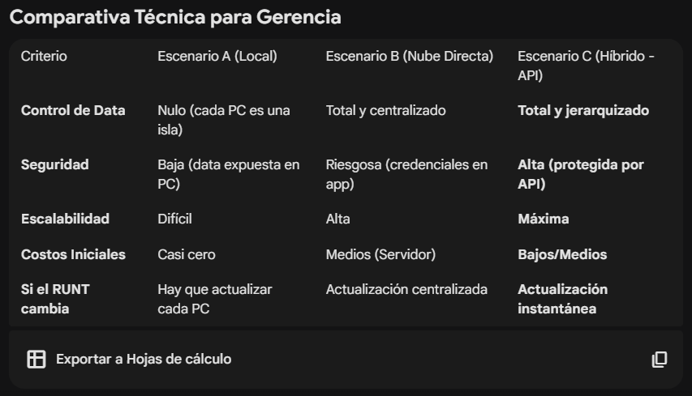

Propuesta Técnica: Sistema de Gestión de Consultas de Tránsito
Contexto
Desarrollo de una herramienta para automatizar la validación de ciudadanos ante el RUNT y SIMIT, con el fin de optimizar el tiempo en recepción y asegurar el cumplimiento normativo.

Escenarios de Implementación
Escenario A: Aplicación Local (Uso Interno)
Cada computador tiene su propia base de datos (archivo local). Los datos no se comparten entre recepcionistas ni entre sedes.

Ideal para: Una única oficina pequeña que no planea expandirse a corto plazo.

Escenario B: Centralización Total (Modelo SaaS/Cloud)
La aplicación de escritorio envía toda la información a un servidor central controlado por nuestra empresa. Toda la data de todas las sedes o clientes externos vive en una sola base de datos en la nube.

Ideal para: Comercializar el software a otras empresas y mantener control total de la propiedad intelectual y los datos.

Escenario C: Modelo Híbrido (Propuesta Recomendada)
La aplicación de escritorio realiza el trabajo pesado (scraping) pero se comunica con un "cerebro" central (API) para guardar reportes, validar licencias de uso y centralizar la información.

Ideal para: Crecimiento exponencial y seguridad sin costos de infraestructura excesivos.

Privacidad y Propiedad: Los datos recolectados (nombres, cédulas, estados de cuenta) se convierten en un activo de nuestra empresa, no del cliente final.

Actualizaciones Silenciosas: Podemos mejorar las reglas de validación (ej. cambiar qué tipo de multa impide el trámite) en el servidor y todas las aplicaciones instaladas se ajustarán al instante.

Resiliencia: Si el volumen de consultas crece, solo escalamos el servidor central, la aplicación de escritorio sigue siendo ligera y rápida.

Próximos Pasos Sugeridos
Finalizar Scrapers: Terminar la integración de SIMIT en la arquitectura actual.

Prototipo de API: Crear un servidor mínimo (Backend) para probar la recepción de datos.

Seguridad: Implementar un sistema de "Llaves de Cliente" (API Keys) para la distribución.

